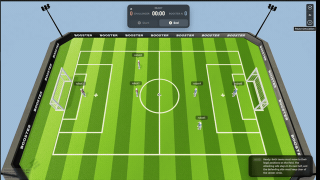
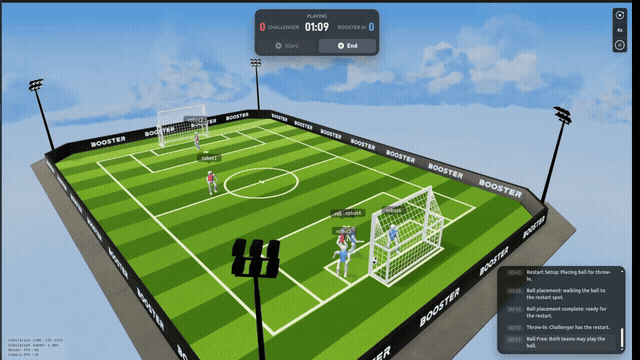
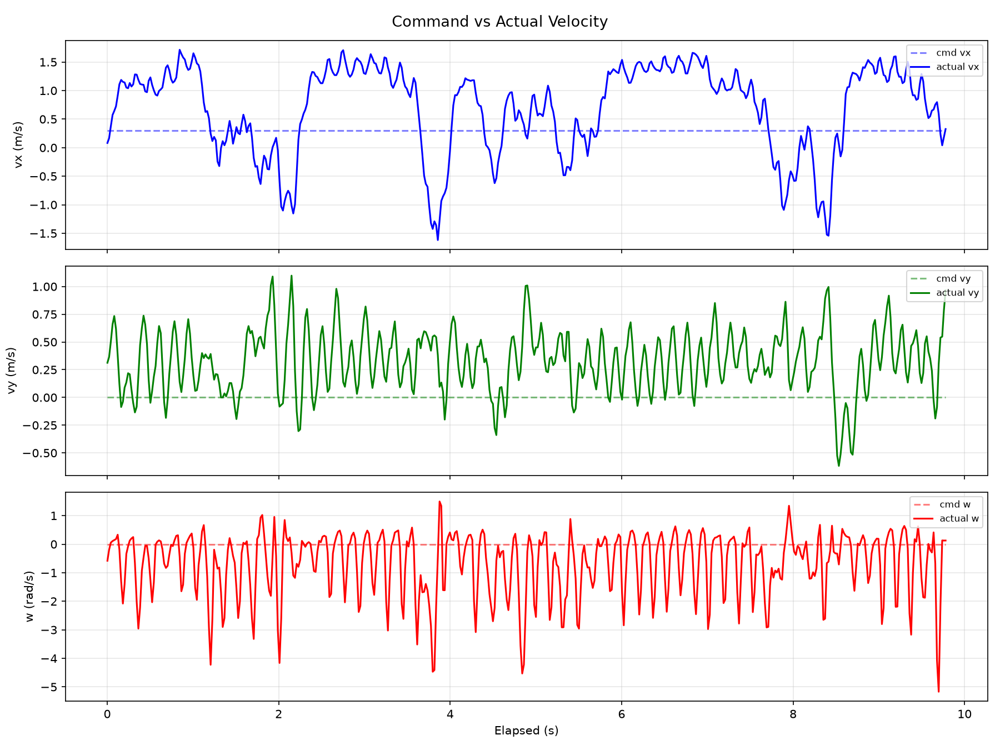

# MotrixArena S2 3v3 机器人足球项目 _(motrixarena-competition-S2)_


面向 MotrixArena S2 的 3v3 机器人足球仿真策略、回放与诊断工程。

本仓库展示了面向 K1 / Pi Plus 机器人足球任务的仿真运行流程，核心由 MotrixSim、Decider 状态机策略和可复现的比赛分析工具组成。仓库包含本地 3v3 回放、轨迹时间序列诊断图和 locomotion 跟踪资产，便于复盘比赛运行过程。

[English](README.md)


## 效果展示









## 背景

MotrixArena S2 聚焦仿真机器人足球。多台机器人需要在场地内完成找球、接近、从合适角度推向对方球门，并保持辅助或防守站位，同时避免队友之间互相干扰。

本项目将高层足球行为放在 Decider 层，主策略入口为 [`decider/user_entry.py`](decider/user_entry.py)，状态机逻辑位于 [`decider/logic/`](decider/logic/)。录制与分析脚本用于保证每次运行都可按帧复现和检查。

## 安装

克隆仓库并安装 Python 依赖：

```bash
git clone https://github.com/Logic-TARS/motrixarena-competition-S2.git
cd motrixarena-competition-S2
python3 -m pip install --user uv
pip install -r requirements.txt
```

容器化配置见 [`compose.yaml`](compose.yaml)。示例使用的默认 K1 policy 模型为 [`models/k1/model_4700.pt`](models/k1/model_4700.pt)。

## 使用

启动仿真：

```bash
# 1v1 实时仿真
./scripts/start_sim.sh

# 3v3 实时仿真
./scripts/start_sim.sh --team-size 3

# 指定 policy
./scripts/start_sim.sh --policy models/k1/model_4700.pt
```

启动单个 Decider 进程：

```bash
./scripts/start_decider.sh
./scripts/start_decider.sh --color blue --id 0 --port 5556
```

启动或停止整队：

```bash
./decider/scripts/start_team.sh
./decider/scripts/start_team.sh --red 3 --blue 2
./decider/scripts/start_team.sh --kill
```

录制比赛：

```bash
# 录制 1v1，默认 60 秒
./scripts/record_match.sh

# 录制 3v3 demo，持续 120 秒
./scripts/record_match.sh --demo-3v3 --d 120

# 同时记录视频和轨迹 CSV
./scripts/record_match.sh --trajectory
```

## 比赛结果

| 项目 | 内容 |
| --- | --- |
| 比赛 | MotrixArena S2 机器人足球仿真比赛 |
| 奖项 | 优胜奖 |
| 排名 | 第 10 名 |
| 进球率 | 高于 70% |
| 机器人平台 | K1 / Pi Plus |
| 决策框架 | Decider 状态机 |
| 仿真平台 | MotrixSim，兼容 Isaac Sim 历史实现 |
| 主要进攻策略 | `ContinuousPushController` |

<a id="demo-replay"></a>

## Demo / 回放

| 资产 | 链接 | 说明 |
| --- | --- | --- |
| 3v3 比赛回放 | [`football-1.mp4`](docs/assets/demo/football-1.mp4) | 本地录制的 3v3 仿真回放 |
| 轨迹时间序列 | [`demo-trajectory-timeseries.png`](docs/assets/demo/demo-trajectory-timeseries.png) | 机器人、球和控制命令随时间变化 |
| Locomotion 速度跟踪 | [`loco-v030-velocity-tracking.png`](docs/assets/demo/loco-v030-velocity-tracking.png) | `T1_forward_velocity/v030` 的速度跟踪诊断图 |

## 系统架构

```text
motrixarena-competition-S2/
├── decider/                   # 决策运行时和策略逻辑
│   ├── user_entry.py          # 自定义策略入口
│   ├── decider.py             # Decider 运行时
│   ├── interfaces/            # 动作、视觉、比赛控制和仿真接口
│   ├── logic/                 # 状态机与角色策略
│   └── scripts/               # 队伍启动和诊断脚本
├── simulation/                # MotrixSim 与历史 Isaac Sim 集成
├── MotrixLab/                 # K1 locomotion 与 policy 执行子项目
├── models/k1/                 # 默认 K1 policy 模型
├── docs/assets/demo/          # Demo 回放和诊断图
└── scripts/                   # 仿真、决策和录制辅助脚本
```

## 策略设计

在仿真模式下，`game(agent)` 按机器人 ID 分配角色：

| Robot ID | 角色 | 行为 |
| --- | --- | --- |
| `0` | Attacker | 找球并向对方球门方向推球 |
| `1` | Support | 站在球与己方球门连线后方，避免阻挡进攻机器人 |
| `2` | Defender | 锚定己方半场防守位置，并跟随球的横向位置 |
| 其他 ID | Fallback attacker | 使用进攻机器人行为路径 |

`ContinuousPushController` 将单纯追球转化为可控的推球流程。控制器持续估计球后方深度、相对球-门连线的横向偏差、朝向误差、到球距离和边线风险，并为接近、对齐、推球阶段生成平滑速度命令。

## 诊断工具

| 工具 | 用途 |
| --- | --- |
| [`scripts/record_match.sh`](scripts/record_match.sh) | 启动仿真和 decider 进程，记录帧并编码比赛视频 |
| `--record-trajectory` / `--trajectory` | 为运行过程启用轨迹 CSV 记录 |
| [`decider/scripts/analyze_trajectory.py`](decider/scripts/analyze_trajectory.py) | 生成轨迹摘要和图表 |
| [`decider/scripts/diagnose_trajectory.py`](decider/scripts/diagnose_trajectory.py) | 诊断推球和对齐相关失败模式 |

轨迹记录包含机器人位姿、球位置、速度命令、FSM 状态、对齐模式、踢球条件和控制器诊断量。

## 仓库结构

```text
.
├── decider/                   # 决策运行时和策略逻辑
├── simulation/                # 仿真集成
├── MotrixLab/                 # K1 locomotion 与 policy 执行
├── models/k1/                 # 默认 K1 policy 模型
├── docs/assets/demo/          # Demo 回放和诊断图
├── scripts/                   # 启动与录制脚本
├── requirements.txt
├── compose.yaml
├── LICENSE
└── COPYRIGHT
```

## 贡献

欢迎通过 GitHub Issues 反馈问题，也欢迎提交 Pull Request。文档、复现实验说明和诊断脚本改进优先。除非对评审或复现必要，请避免提交大体积生成资产。

## 许可证

GPL-3.0-or-later © MOS-Brain Contributors.

许可证和归属信息见 [`LICENSE`](LICENSE) 与 [`COPYRIGHT`](COPYRIGHT)。
