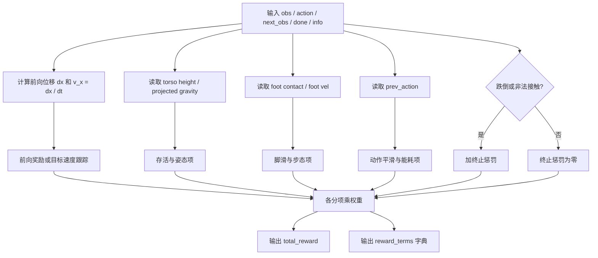

# 人形机器人向前走奖励函数设计研究报告

## 执行摘要

在“人形机器人强化学习的向前走”这一类任务里，最常见、也最稳定的奖励设计思路，不是只写一个“速度越大越好”的单项奖励，而是把**任务项**与**正则项**分开：任务项负责推动机器人沿目标方向产生净前进，正则项负责抑制会导致跌倒、滑脚、抖动、能耗过高或利用环境漏洞的“投机行为”。经典 MuJoCo/Gymnasium 基准中的 Humanoid 与 Walker2d 都采用了“前向奖励 + 存活奖励 − 控制代价（再减接触代价）”的骨架；而现代人形/足式训练框架如 Isaac Lab，则进一步系统化为“速度跟踪 + 姿态/接触/动作平滑/终止惩罚”的加权和。citeturn15view0turn11view1turn17search0turn17search1turn7view0

如果只问“最基本的向前走奖励怎么写”，一个可靠的起点是
\[
r_t = k_v\,v_{x,t} - k_u\lVert a_t\rVert_2^2,
\qquad
v_{x,t}=\frac{x_{t+1}-x_t}{\Delta t},
\]
其中 \(x\) 是机体根部或质心在世界坐标系 \(x\) 轴上的位置，\(\Delta t\) 是控制步长。再往前走一步，工程上更常用的版本会加上**存活/健康奖励、姿态惩罚、动作变化惩罚、脚滑惩罚、跌倒终止惩罚**。这种写法与 Gymnasium Humanoid 的“healthy + forward − ctrl − contact”和 Isaac Lab H1/G1 的“速度跟踪 + flat_orientation + action_rate + feet_slide + termination_penalty”属于同一设计族。citeturn15view0turn12view6turn17search0turn17search1turn19view0

一个特别重要但经常被忽略的事实是：**系数大小没有脱离动作语义、控制频率和物理单位的“通用真值”**。若动作是标准化的策略输出或 PD 目标，动作正则的系数常在 \(10^{-3}\) 到 \(10^{-2}\) 量级；若惩罚的是实际关节力矩平方，系数可能小到 \(10^{-7}\) 到 \(10^{-5}\)；而如果直接对 MuJoCo torque action 施加控制代价，Gymnasium Humanoid 的默认 `ctrl_cost_weight` 甚至是 \(0.1\)。同时，控制步长变化会改变单位时间累计奖励，legged_gym 甚至会在内部把 reward scales 乘上 \(\Delta t\) 来做“按秒归一”。citeturn15view0turn11view1turn7view0turn43view1turn43view2

对未指定具体平台的通用人形仿真任务，我的建议是：先用**世界坐标系正 \(x\) 方向的净前进速度**作为主奖励；如果任务是“给定目标速度”，则把主奖励替换成**速度跟踪项**；任何时候都应加入至少一类**防跌倒**与至少一类**平滑/能耗**正则项；脚接触相关奖励只在你确认传感器可靠时再加入到主训练回路中，因为某些环境版本和仿真后端中，接触力读数本身就可能存在已知问题。citeturn15view1turn20view0turn28view0

## 假设与问题定义

本报告采用如下明确假设。机器人平台未指定，因此按**通用浮动基人形机器人**处理，仿真平台默认覆盖 MuJoCo / Gymnasium、Isaac Lab / Isaac Gym 这一类主流研究环境；任务为“向前走”，方向未指定，因此假设为**世界坐标系 \(x\) 轴正向**；目标速度未指定，因此同时讨论两种常见模式：**自由前进模式**（只要求往前走，速度越大越好）与**命令跟踪模式**（给定 \(v_x^\star\)，要求稳定跟踪）。这两种模式分别对应 Gymnasium Humanoid/Walker2d 一类“最大化前向进展”和 Isaac Lab / dm_control 一类“跟踪命令或目标速度”的设计习惯。citeturn15view0turn11view1turn25view0turn25view1turn17search0turn17search1

还需要明确两个未指定但会显著影响奖励尺度的工程变量。其一是**动作语义**：在 Gymnasium Humanoid 中，动作直接表示关节 torque；而在 Isaac Lab 的 manager-based 速度任务里，教程示例常把动作定义为关节位置目标（带默认 offset 与比例缩放），因此“动作惩罚”和“力矩惩罚”的系数不可直接照搬。其二是**控制步长 \(\Delta t\)**：Gymnasium Humanoid 的默认动作间隔约为 \(0.015\) 秒，Walker2d 为 \(0.008\) 秒，Isaac Lab 教程示例给出的 `sim.dt=0.005` 与 `decimation=4` 对应控制步长 \(0.02\) 秒，dm_control Humanoid/Walker 的 control timestep 则为 \(0.025\) 秒。citeturn15view0turn11view1turn15view4turn7view0turn25view0turn25view1

记 \(s_t\) 为状态、\(o_t\) 为观测、\(a_t\) 为策略动作、\(s_{t+1}\) 为下一状态、\(\Delta t\) 为控制周期；\(x_t,z_t\) 分别为根部或质心的前向位置与高度；\(\mathbf q_t,\dot{\mathbf q}_t\) 为关节角与角速度；\(\tau_t\) 为关节力矩；\(\mathbf g_t^b\) 为机体坐标系下投影重力向量；\(c_{i,t}\in\{0,1\}\) 表示第 \(i\) 只脚是否接触地面。为了让讨论更有可复用性，下面统一把奖励写成
\[
r_t = \sum_j w_j\,\phi_j(s_t,a_t,s_{t+1}) - \lambda_{\text{term}}\mathbf 1[\text{terminal at }t],
\]
其中 \(\phi_j\) 是各个分项，\(w_j\) 是权重。这个写法与 Gymnasium 的分项 `forward_reward / ctrl_cost / healthy_reward / contact_cost`，以及 Isaac Lab 中把每个 RewTerm 加权求和的机制是一致的抽象。citeturn15view0turn12view6turn21search7

从目标角度看，“向前走”最直接的物理目标是最大化一段时间内的净前向位移：
\[
\max \; \mathbb E[x_T-x_0]
= \max \; \mathbb E\!\left[\sum_{t=0}^{T-1} (x_{t+1}-x_t)\right]
= \max \; \mathbb E\!\left[\sum_{t=0}^{T-1} v_{x,t}\Delta t\right].
\]
因此，只要 \(\Delta t\) 固定，最大化累计前向位移与最大化累计前向速度在优化意义上是等价的；这就是为什么很多环境直接使用 \(\frac{dx}{dt}\) 作为 forward reward。Gymnasium Humanoid 明确采用质心 \(x\) 位移除以 \(\Delta t\) 的形式，Walker2d 也是同型思路。citeturn15view0turn11view1

这里还需要特别强调方向性的定义。若任务确实是“向前走”，主奖励就应该保留**符号信息**，即用 \(v_x\) 或 \(x_{t+1}-x_t\)，而不是简单用 \(\|v_{xy}\|\)。dm_control 的 Humanoid 任务就指出，如果只要求达到某个水平速度而不严格约束前向朝向，可能出现“向后跑”或“侧着跑”等多种可行风格；这从 benchmarking 角度未必错，但对于“沿 \(x\) 轴正向”这个任务定义来说，通常不是我们想要的最优解。citeturn23view1turn25view0

## 常见奖励项与写法

### 任务主项

**前向速度或前向进展项**是最基本的任务项。两种最常见写法分别是
\[
r_{\text{fwd},t}=w_{\text{fwd}}\,v_{x,t},
\qquad
v_{x,t}=\frac{x_{t+1}-x_t}{\Delta t},
\]
以及
\[
r_{\text{prog},t}=w_{\text{prog}}\,(x_{t+1}-x_t).
\]
前者更便于跨不同控制频率比较，后者更贴近“位移差分”。Gymnasium Walker2d 的默认 `forward_reward_weight=1.0`，Humanoid-v5 的默认 `forward_reward_weight=1.25`；从这些经典环境到现代 humanoid 速度任务，主任务项的“量级锚点”大致都在 \(O(1)\) 每步附近。其物理意义非常直接：让策略偏好那些在单位时间内产生更大净前向位移的动作。citeturn11view1turn15view0

**目标速度跟踪项**更适合“希望稳定走到某个速度，而不是越快越好”的场景。Isaac Lab 常用指数核：
\[
r_{\text{track},t}
=
w_v \exp\!\left(
-\frac{\lVert \mathbf v^{\text{cmd}}_{xy,t}-\mathbf v^{\text{body}}_{xy,t}\rVert_2^2}{\sigma_v^2}
\right),
\]
并再配一个偏航角速度跟踪项
\[
r_{\omega,t}
=
w_\omega \exp\!\left(
-\frac{(\omega^{\text{cmd}}_{z,t}-\omega_{z,t})^2}{\sigma_\omega^2}
\right).
\]
Isaac Lab 官方 `track_lin_vel_xy_exp` 就采用此公式；H1/G1 的 `std` 都设为 \(0.5\)，线速度权重常为 \(1.0\)，偏航角速度权重在 H1 中为 \(1.0\)、G1 中为 \(2.0\)。这类项的物理意义是：把“跟踪精度”直接塑形成 \(0\) 到 \(1\) 附近的平滑奖励，便于多项加权。citeturn16view3turn17search0turn17search1

**健康/存活奖励**通常与前向项配对使用。Gymnasium Walker2d 的默认 `healthy_reward=1.0`，Humanoid-v5 的默认 `healthy_reward=5.0`。常见抽象写法为
\[
r_{\text{alive},t}=w_{\text{alive}}\,\mathbf 1[z_t\in[z_{\min},z_{\max}] \land \text{robot healthy}],
\]
其中健康条件至少包含“躯干高度在范围内”。MuJoCo Humanoid-v5 的默认健康高度范围为 \([1.0,2.0]\)。其物理意义并不是“奖励站着不动”，而是避免策略通过一次性前扑、跳摔等方式刷出短时速度峰值。citeturn15view0turn14view1turn14view0

### 正则项

**能耗/力矩惩罚**最常见有两类。一类直接惩罚动作幅度：
\[
r_{\text{act},t}=-w_u\lVert a_t\rVert_2^2,
\]
Gymnasium Walker2d 的默认 `ctrl_cost_weight` 为 \(10^{-3}\)，Humanoid-v5 为 \(0.1\)。另一类惩罚实际关节力矩平方：
\[
r_{\tau,t}=-w_\tau\lVert \tau_t\rVert_2^2.
\]
这在 Isaac Lab 中对应 `dof_torques_l2` 或 `joint_torques_l2` 一类项；官方教程示例给过 \(-10^{-5}\) 的量级，G1 粗糙地形配置中则约为 \(-1.5\times10^{-7}\)，H1 粗糙地形默认甚至关掉了这一项。它们的共同物理意义是削弱“过猛、过硬、难迁移”的控制解，但系数尺度**强依赖动作语义**，不能混用。citeturn11view1turn15view0turn7view0turn17search1turn17search0

**动作变化惩罚与加速度惩罚**主要负责抑制高频抖动。典型写法为
\[
r_{\Delta a,t}=-w_{\Delta a}\lVert a_t-a_{t-1}\rVert_2^2,
\qquad
r_{\ddot q,t}=-w_{\ddot q}\lVert \ddot{\mathbf q}_t\rVert_2^2.
\]
Isaac Lab 官方的 `action_rate_l2` 正是 \(\lVert a_t-a_{t-1}\rVert_2^2\)；H1/G1 任务中该项权重常设为 \(-0.005\)，教程示例常设为 \(-0.01\)。`dof_acc_l2`（加速度惩罚）在 H1/G1 中大约是 \(-1.25\times10^{-7}\)，教程示例大约是 \(-2.5\times10^{-7}\)。它们的物理意义在于把控制带宽往“更平滑、更可执行”一侧拉。citeturn16view4turn17search0turn17search1turn7view0

**姿态/平衡项**是人形向前走里不可或缺的第二主层。一个经典写法是用机体坐标系下投影重力的横向分量惩罚非直立姿态：
\[
r_{\text{ori},t}=-w_{\text{ori}}\lVert \mathbf g^b_{xy,t}\rVert_2^2.
\]
这正是 Isaac Lab `flat_orientation_l2` 的定义。再配合
\[
r_{\omega,xy,t}=-w_{\omega,xy}\lVert \boldsymbol\omega^b_{xy,t}\rVert_2^2,
\]
即可抑制躯干横滚与俯仰抖动。H1/G1 配置中 `flat_orientation_l2` 权重常设为 \(-1.0\)，教程中的 `ang_vel_xy_l2` 则约为 \(-0.05\)。其物理意义是把“保持躯干稳定、避免用躯干大摆动换速度”显式纳入目标。citeturn4view1turn17search0turn17search1turn7view0

### 脚接触与步态项

**脚滑惩罚**是现代足式/人形 locomotion 中很常见、也很“值回票价”的一项：
\[
r_{\text{slide},t}
=
-w_{\text{slide}}
\sum_i c_{i,t}\,\lVert \mathbf v^{\text{foot},i}_{xy,t}\rVert_2 .
\]
Isaac Lab 的 `feet_slide` 正是“脚接触时脚平面速度范数”的求和；G1 的权重大约为 \(-0.1\)，H1 为 \(-0.25\)。其物理意义是防止策略学出“滑冰式前进”——即脚不抬离地面，只靠接触模型或摩擦细节在地面上蹭着走。citeturn19view0turn17search0turn17search1

**脚腾空时间/步态节律奖励**经常充当“隐式步频、隐式单支撑时序”的代理项。Isaac Lab 的双足专用版本 `feet_air_time_positive_biped` 会利用当前 air time、contact time 与 single-stance 条件，奖励“一次只抬一只脚”且抬脚/支撑时间不过短的步态，其核心可写成
\[
r_{\text{air},t}
=
w_{\text{air}}\,
\min\!\Big(
\min_i \big(\text{in\_mode\_time}_{i,t}\cdot \mathbf 1[\text{single\_stance}_t]\big),
\; T_{\max}
\Big),
\]
再对小指令速度场景置零。H1/G1 中该项权重均约为 \(0.25\)，官方教程中的通用起点则是 \(0.125\)，阈值常见 \(0.4\sim0.5\) 秒。物理意义是鼓励真正的摆动—支撑交替，而不是双脚始终贴地拖行。citeturn19view0turn17search0turn17search1turn7view0

**非法接触/大接触力惩罚**通常用于阻止“膝走”“躯干刮地前进”或高冲击碰撞。Gymnasium Humanoid-v5 的 `contact_cost` 写成
\[
r_{\text{contact},t}
=
-w_c \,\mathrm{clamp}\!\left(\lVert F_{\text{contact},t}\rVert_2^2\right),
\]
默认 `contact_cost_weight=5\times10^{-7}`；Isaac Lab 还提供 `undesired_contacts`，按超过阈值的非法接触次数记惩罚，教程中的权重起点约为 \(-1.0\)。这类项的物理意义是把“碰撞方式不对”单独编码，而不让策略把碰撞仅仅当作一种廉价推进手段。citeturn15view0turn16view3turn7view0

**步长/步频辅助奖励**在论文和开源框架里并不是默认标配；官方实现更常用的是上面的 air-time / single-stance 代理项。若你必须显式写出来，工程上可定义
\[
r_{\text{stride},t}
=
w_\ell \sum_i \ell_{i,t}\,\mathbf 1[\text{first\_contact of foot }i],
\qquad
\ell_{i,t}
=
\big\lVert
\mathbf p^{\text{foot},i}_{\text{touchdown}}
-
\mathbf p^{\text{foot},i}_{\text{liftoff}}
\big\rVert_2,
\]
或者定义步频跟踪项
\[
r_{\text{cad},t}= -w_f\,(f_{\text{step},t}-f^\star)^2.
\]
但在未指定参考步态、未指定腿长、未指定期望 cadence 的前提下，我更建议先用 `feet_air_time_positive_biped` 这类代理项，而不是一上来把步长/步频目标硬编码死。前者在现成框架中更普遍，也更容易调。citeturn19view0turn17search0turn17search1

**带参考动作或参考步态的辅助奖励**属于更“强指导”的方案。若你不是从零学 walking，而是希望靠参考动作快速得到自然步态，DeepMimic 把 imitation reward 分解为关节姿态、关节速度、末端位置与质心位置四项：
\[
r_t^{I}=w_p r_t^p + w_v r_t^v + w_e r_t^e + w_c r_t^c,
\]
其中论文给出的权重是 \(w_p=0.65,\;w_v=0.1,\;w_e=0.15,\;w_c=0.1\)，每个子项又用指数核度量误差。它的意义不是“更基本”，而是当你想要**更像人走路**或希望缩短探索时间时，可以把 walking 先验显式引入。citeturn26view4turn26view5

### 终止、稀疏与缩放

**终止/倒地惩罚**是把“摔倒”从连续正则项升级为离散约束。典型写法为
\[
r_{\text{fall},t}=-w_{\text{fall}}\mathbf 1[\text{fell or illegal torso contact}],
\]
并在 `done=True` 时触发。Isaac Lab H1/G1 的 `termination_penalty` 直接设为 \(-200\)；Gymnasium Humanoid-v5 则通过 `healthy_z_range` 和 `terminate_when_unhealthy=True` 控制终止逻辑。物理意义是强烈打击“一瞬间冲得很快但之后必摔”的局部最优。citeturn17search0turn17search1turn14view1

**稀疏奖励与密集奖励**没有绝对优劣，但对 humanoid 而言，纯稀疏设计通常更难训练。Heess 等人展示过，在足够丰富的环境与课程下，仅用基于 forward progress 的简单奖励也能学出跑、跳、跨越障碍等行为；但在高维 humanoid benchmark 上，Meser 等人的 MuJoCo MPC 研究又表明，稀疏任务奖励会诱发“不真实、不可持续”的行为，必须额外加入稳定性与密集残差项。对 humanoid walking，从工程上看，最稳妥的做法仍然是：**主任务用密集前进/跟踪项，安全与自然性靠密集正则项补齐**。citeturn23view0turn28view0

**奖励缩放与归一化**不是“锦上添花”，而是 PPO 稳定性的核心前提之一。Stable-Baselines3 明确提示：value function clipping 对 reward scaling 很敏感；legged_gym 则在内部把非零 reward scales 乘上 \(\Delta t\)，以尽量维持“按秒计量”的一致性。再结合一项来自人形研究的实证：PBRS 在高维 humanoid 上对收敛速度的提升有限，但对权重缩放更稳健，更容易调参。综合这些证据，一个好的工程准则是：先把每个分项做成可解释、量纲清楚的 \(\phi_i\)，再调 \(w_i\)，而不是把所有物理量混在一个未经缩放的总式里硬凑。citeturn35view0turn43view1turn38view0

## 最基本的向前走奖励

### 版本一

最小可用版本建议写成
\[
r_t = k_v\,v_{x,t} - k_u\lVert a_t\rVert_2^2,
\qquad
v_{x,t}=\frac{x_{t+1}-x_t}{\Delta t}.
\]

这里的含义非常清楚。\(k_v>0\) 推动前进，\(k_u>0\) 抑制过大的动作。若动作是**标准化关节目标**或 \([-1,1]\) 范围的 policy action，可以先把 \(k_v\) 设在 \(1.0\) 左右，再把 \(k_u\) 设成 \(10^{-3}\) 到 \(10^{-2}\) 的小量；若动作本身是**实际 torque**，则要参考平台的动作范围重调，Gymnasium Walker2d 的默认 `ctrl_cost_weight=1e-3`、Humanoid-v5 的默认 `ctrl_cost_weight=0.1` 已经说明了这一点。这个版本足够简单，常用于先验证“观测、动作、仿真、PPO 管线是否通”的基线实验。citeturn11view1turn15view0

这一版本的优点是几乎没有额外假设；缺点也同样明显：它没有直接约束直立、跌倒、滑脚与抖动，所以经常会学出“冲一下、倒一下”或者“前向抖动很大”的策略。如果你在 rich environment 或特别简单的 locomotion toy setup 中训练，它有机会成功；但对人形机器人，通常不够。citeturn23view0turn28view0

### 版本二

一个更接近实际 humanoid 训练的基础版可以写成
\[
\begin{aligned}
r_t =&\;
k_v\,\mathrm{clip}(v_{x,t},-v_{\max},v_{\max})
+ k_{\text{alive}}\mathbf 1[z_{t+1}\in[z_{\min},z_{\max}]]
\\
&-k_u\lVert a_t\rVert_2^2
-k_{\Delta a}\lVert a_t-a_{t-1}\rVert_2^2
-k_{\text{ori}}\lVert \mathbf g^b_{xy,t+1}\rVert_2^2
-k_{\text{slide}}\sum_i c_{i,t+1}\lVert \mathbf v^{\text{foot},i}_{xy,t+1}\rVert_2
\\
&-k_{\text{fall}}\mathbf 1[\text{done}_t \land \neg \text{healthy}_{t+1}].
\end{aligned}
\]

这就是“前进 + 存活 + 平滑 + 直立 + 防滑 + 跌倒”的最小工程闭环。它不是某一篇论文的逐字照搬，而是把 Gymnasium Humanoid/Walker2d 的前向—存活—控制骨架，与 Isaac Lab H1/G1 的 `flat_orientation_l2`、`action_rate_l2`、`feet_slide`、`termination_penalty` 合并后的通用写法。若任务改成“跟踪某个目标速度”，则只需把 \(k_v v_x\) 换成上一节的指数型 tracking term 即可。citeturn15view0turn11view1turn17search0turn17search1turn19view0

一个实用的起始参数模板可以是：\(k_v=1.0\)，\(k_{\text{alive}}=1\sim5\)，\(k_{\Delta a}=5\times10^{-3}\sim10^{-2}\)，\(k_{\text{ori}}=0.5\sim1.0\)，\(k_{\text{slide}}=0.1\sim0.25\)，\(k_{\text{fall}}=50\sim200\)。其中 \(k_{\text{fall}}\) 的上界非常受 episode 长度影响；如果 episode 很短而终止惩罚太小，策略很容易把“最后一刻摔倒”当成可接受的代价。HumanoidBench 相关分析也提醒过：过短的评估时长会掩盖末端失稳问题。citeturn17search0turn17search1turn7view0turn28view0

### 伪代码

下面给出一个与常见 RL 环境接口兼容的伪代码。输入为 `obs, action, next_obs, done, info`，输出为 `reward` 与 `reward_terms` 字典。

```text
function compute_reward(obs, action, next_obs, done, info, cfg):
    dx = next_obs.root_pos[0] - obs.root_pos[0]
    vx = dx / cfg.dt

    reward_fwd = cfg.k_v * clip(vx, -cfg.v_clip, cfg.v_clip)
    reward_act = -cfg.k_u * sum(action^2)

    healthy = (cfg.z_min <= next_obs.root_pos[2] <= cfg.z_max)

    reward_alive = cfg.k_alive if healthy else 0
    reward_action_rate = -cfg.k_da * sum((action - obs.prev_action)^2)
    reward_orientation = -cfg.k_ori * sum(next_obs.projected_gravity[:2]^2)

    slip = 0
    for each foot i:
        if next_obs.foot_contact[i]:
            slip += norm(next_obs.foot_vel_xy[i])
    reward_slide = -cfg.k_slide * slip

    fall_penalty = 0
    if done and not healthy:
        fall_penalty = -cfg.k_fall

    total_reward =
        reward_fwd + reward_alive + reward_act
        + reward_action_rate + reward_orientation
        + reward_slide + fall_penalty

    return total_reward, {
        "vx": vx,
        "reward_fwd": reward_fwd,
        "reward_alive": reward_alive,
        "reward_act": reward_act,
        "reward_action_rate": reward_action_rate,
        "reward_orientation": reward_orientation,
        "reward_slide": reward_slide,
        "fall_penalty": fall_penalty
    }
```

这个流程与 Gymnasium 环境中把 forward、ctrl、alive 分项写进 `info` 的做法，以及 legged locomotion 框架里记录 episode reward sums 的做法完全一致；推荐你从第一天起就返回分项，而不是只返回总奖励。citeturn12view6turn11view1turn42view0

### Python 示例实现

```python
from __future__ import annotations

from dataclasses import dataclass
from typing import Any, Dict, Tuple

import numpy as np


@dataclass
class WalkRewardConfig:
    """Configuration for a basic humanoid forward-walking reward."""
    dt: float = 0.02

    # task
    k_v: float = 1.0
    v_clip: float = 2.0

    # regularization
    k_u: float = 1e-3          # action magnitude penalty
    k_da: float = 5e-3         # action-rate penalty
    k_ori: float = 1.0         # torso orientation penalty
    k_slide: float = 0.1       # foot sliding penalty

    # health / terminal
    k_alive: float = 1.0
    k_fall: float = 100.0
    z_min: float = 0.8
    z_max: float = 1.6


def _as_np(x: Any, shape: Tuple[int, ...] | None = None) -> np.ndarray:
    arr = np.asarray(x, dtype=np.float32)
    if shape is not None and arr.shape != shape:
        raise ValueError(f"Expected shape {shape}, got {arr.shape}")
    return arr


def compute_basic_forward_reward(
    obs: Dict[str, Any],
    action: np.ndarray,
    next_obs: Dict[str, Any],
    done: bool,
    info: Dict[str, Any] | None,
    cfg: WalkRewardConfig,
) -> Tuple[float, Dict[str, float]]:
    """
    Minimal reward:
        r = k_v * v_x - k_u * ||a||^2

    Required keys:
        obs["root_pos"]      : shape (3,)
        next_obs["root_pos"] : shape (3,)

    Inputs:
        obs       : current observation dict
        action    : current action, shape (n_act,)
        next_obs  : next observation dict
        done      : whether the episode ended after this step
        info      : optional aux info dict (unused here, kept for env API compatibility)
        cfg       : reward coefficients

    Outputs:
        reward          : scalar float
        reward_terms    : dict with decomposed reward terms
    """
    del done, info  # unused in the minimal version

    root_pos = _as_np(obs["root_pos"], (3,))
    next_root_pos = _as_np(next_obs["root_pos"], (3,))
    action = _as_np(action)

    vx = float((next_root_pos[0] - root_pos[0]) / cfg.dt)
    reward_fwd = cfg.k_v * vx
    reward_act = -cfg.k_u * float(np.dot(action, action))

    reward = reward_fwd + reward_act
    terms = {
        "vx": vx,
        "reward_fwd": reward_fwd,
        "reward_act": reward_act,
        "reward_total": reward,
    }
    return reward, terms


def compute_practical_walk_reward(
    obs: Dict[str, Any],
    action: np.ndarray,
    next_obs: Dict[str, Any],
    done: bool,
    info: Dict[str, Any] | None,
    cfg: WalkRewardConfig,
) -> Tuple[float, Dict[str, float]]:
    """
    Practical reward:
        r = forward + alive - action_l2 - action_rate - orientation - foot_slide - fall_penalty

    Required keys:
        obs["root_pos"]                : shape (3,)
        obs["prev_action"]             : shape (n_act,)
        next_obs["root_pos"]           : shape (3,)
        next_obs["projected_gravity"]  : shape (3,)
        next_obs["foot_contact"]       : shape (n_foot,) bool / {0,1}
        next_obs["foot_vel_xy"]        : shape (n_foot, 2)

    Optional:
        info["fell"]                   : bool (if provided, overrides simple height-based fall detection)
    """
    info = info or {}

    root_pos = _as_np(obs["root_pos"], (3,))
    next_root_pos = _as_np(next_obs["root_pos"], (3,))
    action = _as_np(action)
    prev_action = _as_np(obs["prev_action"], action.shape)

    projected_gravity = _as_np(next_obs["projected_gravity"], (3,))
    foot_contact = _as_np(next_obs["foot_contact"]).astype(bool)
    foot_vel_xy = _as_np(next_obs["foot_vel_xy"])

    if foot_vel_xy.ndim != 2 or foot_vel_xy.shape[1] != 2 or foot_vel_xy.shape[0] != foot_contact.shape[0]:
        raise ValueError(
            "next_obs['foot_vel_xy'] must have shape (n_foot, 2) and match next_obs['foot_contact']."
        )

    # forward progress
    vx = float((next_root_pos[0] - root_pos[0]) / cfg.dt)
    reward_fwd = cfg.k_v * float(np.clip(vx, -cfg.v_clip, cfg.v_clip))

    # health
    height = float(next_root_pos[2])
    healthy = (cfg.z_min <= height <= cfg.z_max)
    if "fell" in info:
        fell = bool(info["fell"])
    else:
        fell = bool(done and not healthy)

    reward_alive = cfg.k_alive if healthy else 0.0

    # regularization
    reward_act = -cfg.k_u * float(np.dot(action, action))
    reward_action_rate = -cfg.k_da * float(np.dot(action - prev_action, action - prev_action))
    reward_orientation = -cfg.k_ori * float(np.dot(projected_gravity[:2], projected_gravity[:2]))

    foot_speed = np.linalg.norm(foot_vel_xy, axis=1)
    slip = float(np.sum(foot_speed * foot_contact.astype(np.float32)))
    reward_slide = -cfg.k_slide * slip

    fall_penalty = -cfg.k_fall if fell else 0.0

    reward = (
        reward_fwd
        + reward_alive
        + reward_act
        + reward_action_rate
        + reward_orientation
        + reward_slide
        + fall_penalty
    )

    terms = {
        "vx": vx,
        "height": height,
        "healthy": float(healthy),
        "fell": float(fell),
        "slip": slip,
        "reward_fwd": reward_fwd,
        "reward_alive": reward_alive,
        "reward_act": reward_act,
        "reward_action_rate": reward_action_rate,
        "reward_orientation": reward_orientation,
        "reward_slide": reward_slide,
        "fall_penalty": fall_penalty,
        "reward_total": reward,
    }
    return reward, terms
```

上面的实现故意把接口做成“**当前观测、动作、下一观测、done、info**”风格，便于直接嵌入 Gymnasium、Isaac 风格包装器或离线重放脚本。若你改成 PyTorch batch 版，只需把 `np` 改为 `torch`、并让 `obs/next_obs` 的每个张量多一个 batch 维即可。代码中的 `projected_gravity`、`foot_contact`、`foot_vel_xy` 对应的正是 Isaac Lab 一类环境中可以直接拿到的观测/传感器量。citeturn4view1turn19view0turn7view0

### 奖励计算流程

下面给出一个通用的奖励计算流程图。它既适用于上面的“版本二”模板，也适用于绝大多数 humanoid walking 任务的 reward logging 结构。其流程抽象自 Gymnasium 的 reward 分项接口、Isaac Lab 的 RewTerm 求和方式和 legged locomotion 框架的 episode reward logging。citeturn12view6turn21search7turn42view0



## 防止作弊、调参与诊断

简单的前向奖励极容易产生“奖励被刷出来了，但行为看上去不对”的问题。下面列出 humanoid walking 中最常见的作弊/劣化模式，以及更稳妥的修正方式。

“**前扑刷速度**”是第一大坑：策略在前几步猛冲，最后直接摔倒，但仍靠短时间的高 \(v_x\) 拿到不错回报。修正方法通常是把**存活奖励、健康高度门限和显式跌倒惩罚**一起启用，或者采用 dm_control 那种“站稳 × 前进 × 小控制”的乘性结构，让“先站住”成为获得移动奖励的前提。Gymnasium Humanoid-v5、Walker2d 与 dm_control Humanoid/Walker 都实现了这类思想。citeturn15view0turn11view1turn25view0turn25view1

“**滑冰式前进**”是第二大坑：脚不真正摆动，而是在接触状态下沿地面高速滑行。修正方法是加入 `feet_slide` 或显式的脚接触—脚速联动惩罚；必要时辅以 `feet_air_time_positive_biped`，让双足单支撑—摆动周期变得更明确。Isaac Lab 的 H1/G1 配置已经是现成范例。citeturn19view0turn17search0turn17search1

“**膝走/躯干擦地前进**”通常出现在只奖励前向位移、但不惩罚非法接触时。修正方法是加入非法接触计数、强化 torso/base contact termination、或者给健康高度加范围约束。Isaac Lab 的 `undesired_contacts` 与 `base_contact` termination，Gymnasium Humanoid 的 `healthy_z_range`，都在解决这个问题。citeturn16view3turn7view0turn14view1

“**高频震荡**”一般来自速度奖励过强、平滑项太弱。典型症状是 `reward_fwd` 很高，但动作、关节速度、脚底接触力出现不自然的高频抖动。修正方法是同时打开 `action_rate_l2`、`dof_acc_l2`、`flat_orientation_l2`、必要时再加 torque limit 惩罚。官方 humanoid/legged 配置几乎都包含这一组“抖动抑制器”。citeturn16view4turn17search0turn17search1turn7view0

“**利用接触传感器或环境漏洞**”是更隐蔽的问题。已知例子包括：Gymnasium 文档指出 `Humanoid-v4` 存在 `contact_cost` 恒为 0 的 bug；legged_gym README 则明确说明，在 GPU + triangle mesh 场景下，某些接触力张量并不可靠，建议使用足端力传感器并避免把不可靠 contact signal 做成关键主奖励。换言之，**接触项再漂亮，也不能盲信传感器本身**。citeturn15view1turn20view0

下表给出一个实用的“系数变化—行为变化”对照表。表中的起步锚点综合自 Gymnasium Humanoid/Walker2d 的默认值、Isaac Lab 通用 velocity 奖励配置、H1/G1 humanoid 配置，以及其中文教程；表里最重要的不是绝对数值，而是**增大/减小某个系数后行为会朝哪里偏移**。citeturn15view0turn11view1turn17search0turn17search1turn7view0

| 系数或超参 | 调大后的典型行为 | 过大时的常见副作用 | 调小后的典型行为 | 起步锚点 |
|---|---|---|---|---|
| \(k_v\) 前向项 | 更积极前冲、更愿意冒险 | 前扑、跑偏、抖动、末端不稳 | 走不起来、站桩 | 1.0 左右 |
| \(k_u\) 动作幅度惩罚 | 更省动作、更保守 | 步幅太小、拖脚 | 动作猛、能耗高 | 归一化动作时 \(10^{-3}\!\sim\!10^{-2}\)；直接 torque action 需重标定 |
| \(k_\tau\) 力矩惩罚 | 更“软”、更可迁移 | 输出不足、上坡/抗扰差 | 扭矩暴力、碰撞大 | 若惩罚实际 torque，常见 \(10^{-7}\!\sim\!10^{-5}\) |
| \(k_{\text{alive}}\) / \(k_{\text{fall}}\) | 更重视别摔倒 | 过于保守，学会慢走甚至不走 | 末端失稳、以摔换速 | \(k_{\text{alive}}=1\!\sim\!5\)，\(k_{\text{fall}}=50\!\sim\!200\) |
| \(k_{\text{ori}}\) 姿态项 | 躯干更稳、更直 | 过于僵硬，转向和快速步态变差 | 扭腰、前倾换速度 | 0.5–1.0 起步 |
| \(k_{\Delta a}\) 动作率项 | 动作更平滑 | 响应迟钝、难抗扰 | 抖动、高频震荡 | \(5\times10^{-3}\!\sim\!10^{-2}\) |
| \(k_{\text{slide}}\) 脚滑项 | 脚底更“咬地” | 过大时不敢摆腿，步态僵 | 滑冰式前进 | 0.1–0.25 |
| \(k_{\text{air}}\) 腾空项 | 更愿意摆腿、单支撑更明显 | 抬脚过高、步态夸张 | 双脚拖行 | 0.125–0.25 |
| \(\sigma_v\) 速度跟踪核宽度 | 奖励峰更宽、训练更容易 | 速度误差容忍过大 | 奖励峰过窄、探索难 | 0.5 |

调参时，建议把监控分成四组。第一组是**任务结果**：平均 \(x\) 向速度、速度误差、净前向位移。第二组是**代价**：动作 L2、扭矩 L2、动作率、接触冲击。第三组是**稳定性**：episode length、跌倒率、健康高度越界率、躯干姿态误差。第四组是**步态质量**：脚腾空时间、脚滑量、左右脚接触占空比、单支撑时长。Gymnasium 会把分项奖励写入 `info`；legged_gym/Isaac 风格实现也会把 reward sums 按 episode 汇总，因此这些指标完全可以自动记录。citeturn12view6turn11view1turn42view0

可视化方面，我推荐至少准备三种图。其一是**速度—时间曲线**，看有没有前几步很快、后面急剧劣化的情况；其二是**reward 分项堆叠图**，看总奖励增长时到底是 forward 项在增长，还是策略只是在压低正则项；其三是**足端接触力热图/脚底滑移热图**，定位“走起来了但像在溜冰”的问题。如果接触奖励是重点，必须在 flat ground 和 rough/mesh 场景分别验证一次，因为某些后端的接触读数可靠性并不一致。citeturn20view0turn19view0turn7view0

## 实验与复现建议

如果目标是快速理解“最基本前向走奖励”的效果，最推荐的起点仍然是 **Gymnasium Humanoid-v5**：它的奖励定义简单、透明、文档完整，而且 forward / ctrl / alive / contact 会拆分到 `info` 中，特别适合做 reward ablation。若要上一个层级，**Isaac Lab H1/G1 velocity tasks** 是今天更贴近真实 humanoid locomotion 的开源模板，里面已经包含了速度跟踪、脚接触、平滑、终止惩罚等现代 reward engineering 组件。若你想比较不同奖励范式，**dm_control Humanoid/Walker** 提供了很有代表性的“乘性 standing × moving × small-control”结构；若你想把 walking 作为更复杂 whole-body 任务的低层技能，**HumanoidBench** 是具有代表性的高维 benchmark。若还希望在更复杂环境中自定义奖励并复用数据集，**LocoMuJoCo** 与 **MuJoCo Playground** 也很值得纳入工具箱。citeturn15view0turn17search0turn17search1turn25view0turn25view1turn6view2turn34search8turn36search0turn36search1

若采用 PPO 作为首选 baseline，建议分平台来设定起始超参。在 **Isaac Lab + RSL-RL** 路线中，官方 H1/G1 粗糙地形 humanoid 任务配置都用 `num_steps_per_env=24`、`max_iterations=3000`、`clip_param=0.2`、`gamma=0.99`、`lam=0.95`、`num_learning_epochs=5`、`num_mini_batches=4`、`learning_rate=1e-3`、`desired_kl=0.01`、`max_grad_norm=1.0`，熵系数大约在 `0.008 ~ 0.01`；网络宽度大致是 `[512,256,128]` 这一档。若走 **Gymnasium + SB3** 路线，PPO 文档默认起点则是 `learning_rate=3e-4`、`n_steps=2048`、`batch_size=64`、`n_epochs=10`、`gamma=0.99`、`gae_lambda=0.95`、`clip_range=0.2`、`ent_coef=0.0`、`max_grad_norm=0.5`。前者更适合大规模并行仿真，后者更适合先做小规模可解释实验。citeturn10view0turn10view1turn35view0

关于归一化，建议把“**观测缩放**”与“**奖励缩放**”分开理解。观测方面，如果环境框架已经对速度、位置、高度图等变量做了手工 scale，并且各维度量级比较接近，可以不额外启用 running normalization；Isaac Lab H1/G1 官方 RSL-RL 配置中就把 actor/critic 的 obs normalization 关掉了。奖励方面则必须谨慎，因为 PPO 的值函数裁剪和优势估计都会受 reward scale 影响；如果你改了控制步长或把某一个分项放大了一个数量级，通常应同步重审其他分项权重。citeturn10view0turn10view1turn35view0turn43view1

若要做“可以写进实验报告”的评估协议，我建议至少包含四类测试。第一类是**命令网格评估**：对 \(v_x^\star\in[0,1.0]\) 的若干离散点分别评估平均速度误差、跌倒率和能耗；这个范围与 Isaac Lab H1/G1 的官方命令范围一致，也适合作为起步区间。第二类是**持续稳定性评估**：同一命令下延长 episode，避免只在短时地平线上看起来还行。第三类是**扰动/地形泛化**：外推到不同摩擦、坡面、粗糙地形、轻推扰动。第四类是**跨种子报告**：至少 3 个随机种子，报告均值和标准差，而不是只放一条最好看的曲线。短 episode 容易高估性能、低估末端失稳，这一点在 HumanoidBench/MJPC 分析里已经被明确指出。citeturn17search0turn17search1turn28view0turn40view3

如果你的最终目标是 sim-to-real，那么只在“前向速度”上做评估是不够的。真实机器人论文已经表明，可靠 deployment 还应该单独测**抗外力扰动、不同地面材料、坡面、载荷变化**等场景；同时，训练阶段需要做**动力学、控制参数、环境物理、观测噪声与时延**的 domain randomization。对于人形 walking 奖励函数来说，这意味着：哪怕你的主任务只有“往前走”，也不要把 reward engineering 只盯在 \(v_x\) 一项上。citeturn39view0turn40view3

若你希望优先看中文资料，建议把 **Tianbot 的 Isaac Lab 奖励/观测/动作调整教程**当作“工程化配置对照表”来读：它把 `track_lin_vel_xy_exp`、`flat_orientation_l2`、`action_rate_l2`、`feet_air_time`、`undesired_contacts` 等项放在一个中文上下文中解释得比较清楚；但真正定稿时，仍应回到 Isaac Lab 官方文档和对应源码确认公式细节。citeturn7view0turn16view3turn16view4

## 结论

对于未指定具体平台的人形机器人“向前走”任务，最稳妥的奖励写法不是追求“复杂”，而是先把目标拆成三个层次。第一层是**前向任务目标**：自由前进就用有符号 \(v_x\) 或 \(\Delta x\)，命令跟踪就用向量速度误差的指数核。第二层是**安全与稳定性**：至少加入健康/跌倒终止、姿态平衡中的一项。第三层是**自然性与可迁移性正则**：动作幅度、动作率、脚滑、非法接触、必要时的脚腾空时序。Gymnasium、dm_control、Isaac Lab、DeepMimic 与最近的人形 benchmark/reality papers，本质上都在这三层空间里做不同取舍。citeturn15view0turn25view0turn17search0turn17search1turn26view4turn28view0

如果只允许给出一句“落地结论”，那就是：**先用世界系正 \(x\) 前进项打通最小闭环，再用姿态、终止、平滑和脚滑项去堵漏洞，最后才考虑显式步长/步频或参考步态奖励。** 这比一开始就堆很多花哨项更稳，也更容易定位问题源头。对大多数人形 walking 项目而言，真正的难点从来不是把公式写长，而是把每个分项写成“物理含义明确、尺度可解释、日志可诊断”的样子。citeturn15view0turn17search0turn17search1turn38view0turn35view0